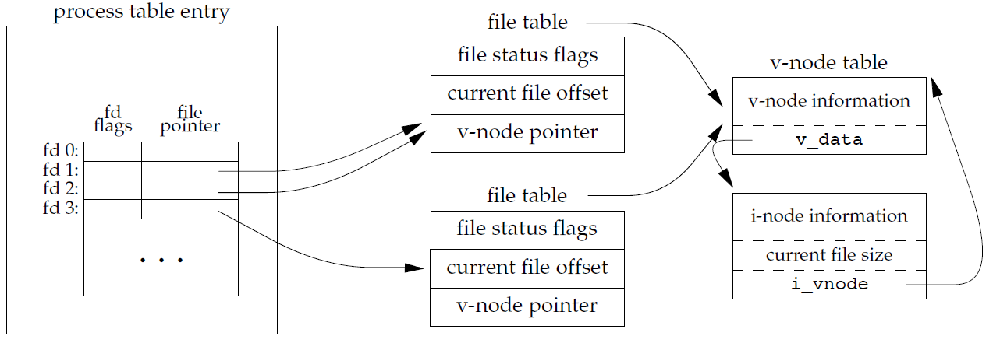

# File I/O

## Exercises

### 3.1

**When reading or writing a disk file, are the functions described in this chapter really unbuffered? Explain.**

所有磁盘 I/O 操作都会经过内核的块缓冲区（也称为内核的缓冲区高速缓存）。由于我们读写的数据会由内核进行缓冲处理，因此 “无缓冲 I/O” 这一术语，特指在使用这两个函数时，用户进程中不存在自动缓冲机制。每一次读取（read）或写入（write）操作都会触发一次系统调用。

### 3.2

**Write your own `dup2` function that behaves the same way as the `dup2` function described in Section 3.12, without calling the `fcntl` function. Be sure to handle errors correctly.**

`dup2`函数原型如下：

```c
#include <unistd.h>
int dup2(int oldfd, int newfd);
```

**代码参考：**[ex3_2.c](ex3_2.c)

### 3.3

**Assume that a process executes the following three function calls:**

```c
fd1 = open(path, oflags);
fd2 = dup(fd1);
fd3 = open(path, oflags);
```

**Draw the resulting picture, similar to Figure 3.9. Which descriptors are affected by an `fcntl` on fd1 with a command of `F_SETFD`? Which descriptors are affected by an `fcntl` on fd1 with a command of `F_SETFL`?**



- `F_SETFD`是文件描述符标志，只作用于一个进程的一个描述符。
- `F_SETFL`是文件状态标志，作用于任何进程中的所有描述符。

**代码参考：**[ex3_3.c](ex3_3.c)

### 3.4

**The following sequence of code has been observed in various programs:**

```c
dup2(fd, 0);
dup2(fd, 1);
dup2(fd, 2);
if (fd > 2)
	close(fd);
```

**To see why the if test is needed, assume that fd is 1 and draw a picture of what happens to the three descriptor entries and the corresponding file table entry with each call to `dup2`. Then assume that fd is 3 and draw the same picture.**

fd = 1，三个文件描述符指向相同的文件表项。dup2(fd, 1)时不需要关闭fd = 1的文件描述符。

fd = 3，四个文件描述符指向相同的文件表项。这种情况下，关闭fd = 3的文件描述符。

### 3.5

**The Bourne shell, Bourne-again shell, and Korn shell notation**
	**`digit1>&digit2`**
**says to redirect descriptor digit1 to the same file as descriptor digit2. What is the difference between the two commands shown below? (Hint: The shells process their command lines from left to right.)**
	`./a.out > outfile 2>&1`
	`./a.out 2>&1 > outfile`

`./a.out > outfile 2>&1` 先将标准输出重定向到outfile，然后将标准错误重定向到标准输出。结果是标准输出和标准错误都输出到outfile。

`./a.out 2>&1 > outfile` 先将标准错误重定向到标准输出，然后将标准输出重定向到outfile。结果是标准输出输出到outfile，标准错误重定向到屏幕。

### 3.6

**If you open a file for read–write with the append flag, can you still `read` from anywhere in the file using `lseek`? Can you use `lseek` to replace existing data in the file? Write a program to verify this.**

在文件中任意位置都可以`lseek`和`read`，但是写操作将自动将文件偏移量设置为文件结尾，所以写操作只能在文件尾部追加，并将更新偏移量至新的末尾。

**代码参考：**[ex3_6.c](ex3_6.c)
