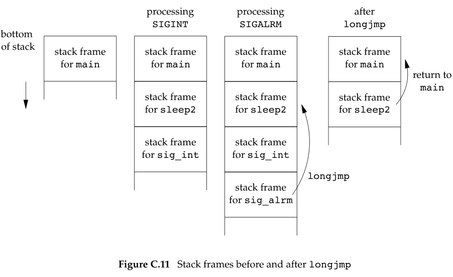

# Process Control

## Exercises

### 10.1

**In Figure 10.2, remove the `for (;;)` statement. What happens and why?**

The program terminates the first time we send it a signal.
The reason is that the `pause` function returns whenever a signal is caught.

### 10.2

**Implement the `sig2str` function described in Section 10.22.**

[ex10_2.c](ex10_2.c)

### 10.3

**Draw pictures of the stack frames when we run the program from Figure 10.9.**



### 10.4

**In Figure 10.11, we showed a technique that’s often used to set a timeout on an I/O
operation using setjmp and longjmp. The following code has also been seen:**

```c
signal(SIGALRM, sig_alrm);
alarm(60);
if (setjmp(env_alrm) != 0) {
    /* handle timeout */
    //...
}
//...
```
**What else is wrong with this sequence of code?**

We again have a race condition, this time between the first call to `alarm` and the call to `setjmp`.
If the process is blocked by the kernel between these two function calls,
the alarm goes off, the signal handler is called, and `longjmp` is called.
But since `setjmp` was never called, the buffer `env_alrm` is not set.
The operation of `longjmp` is undefined if its jump buffer has not been initialized by `setjmp`.

### 10.5

**Using only a single timer (either `alarm` or the higher-precision `setitimer`),
provide a set of functions that allows a process to set any number of timers.**

See ''Implementing Software Timers'' by Don Libes (C Users Journal, vol. 8, no.11, Nov. 1990) for an example.
A copy of this paper is available online at http://www.kohala.com/start/libes.timers.txt.

This is the problem that how to implement a "multi-timer scheduler" in user space.

**Core idea:** Only set the timer that is most likely to expire and store all others in the user-space structure.

### 10.6

**Write the following program to test the parent–child synchronization functions in Figure 10.24.
The process creates a file and writes the integer 0 to the file.
The process then calls fork, and the parent and child alternate incrementing the counter in the file.
Each time the counter is incremented, print which process (parent or child) is doing the increment.**

[ex10_6.c](ex10_6.c)

### 10.7

In the function shown in Figure 10.25, if the caller catches `SIGABRT` and returns from the signal handler,
    why do we go to the trouble of resetting the disposition to its default
    and call kill the second time, instead of simply calling `_exit`?

If we simply called `_exit`, the termination status of the process would not show that it was terminated by the `SIGABRT` signal.

### 10.8

**Why do you think the `siginfo` structure (Section 10.14) includes the real user ID, instead of the effective user ID, in the `si_uid` field?**

If the signal was sent by a process owned by some other user,
    the process has to be set-user-ID to either root or to the owner of the receiving process,
    or the `kill` attempt won’t work.
Therefore, the real user ID provides more information to the receiver of the signal.

### 10.9

Rewrite the function in Figure 10.14 to handle all the signals from Figure 10.1.
The function should consist of a single loop that iterates once for every signal in the current signal mask (not once for every possible signal).

[ex10_9.c](ex10_9.c)

### 10.10

**Write a program that calls `sleep(60)` in an infinite loop.
Every five times through the loop (every 5 minutes), fetch the current time of day and print the `tm_sec` field.
Run the program overnight and explain the results.
How would a program such as the `cron` daemon, which runs every minute on the minute, handle this situation?**

[ex10_10.c](ex10_10.c)

On one system used by the author, the value for the number of seconds increased by 1 about every 60–90 minutes.
This skew occurs because each call to sleep schedules an event for a time in the future,
    but is not awakened exactly when that event occurs (because of CPU scheduling).
In addition, a finite amount of time is required for our process to start running and call sleep again.

A program such as the `cron` daemon has to fetch the current time every minute,
    as well as to set its first sleep period so that it wakes up at the beginning of the next minute.
(Convert the current time to the local time and look at the `tm_sec` value.)
Every minute, it sets the next sleep period so that it'll wake up at the next minute.
Most of the calls will probably be `sleep(60)`, with an occasional `sleep(59)` to resynchronize with the next minute.
But if at some point the process takes a long time executing commands
    or if the system gets heavily loaded and scheduling delays hold up the process,
    the sleep value can be much less than 60.

### 10.11

Modify Figure 3.5 as follows:
    (a) change `BUFFSIZE` to 100;
    (b) catch the `SIGXFSZ` signal using the `signal_intr` function, printing a message when it’s caught, and returning from the signal handler;
    (c) print the return value from `write` if the requested number of bytes wasn’t written.

Modify the soft `RLIMIT_FSIZE` resource limit (Section 7.11) to 1,024 bytes and run your new program,
    copying a file that is larger than 1,024 bytes.
(Try to set the soft resource limit from your shell. If you can’t do this from your shell, call `setrlimit` directly from the program.)
Run this program on the different systems that you have access to. What happens and why?

[ex10_11.c](ex10_11.c)

`dd if=/dev/zero of=bigfile bs=1 count=1200` creates a file.

`./a.out < bigfile > out`

```plaintext
write return 24
caught SIGXFSZ
write return -1
```

Under Linux 3.2.0, Mac OS X 10.6.8, and Solaris 10, the signal handler for `SIGXFSZ` is never called.
But write returns a count of 24 as soon as the file's size reaches 1,024 bytes.
When the file's size has reached 1,000 bytes under FreeBSD 8.0,
    the signal handler is called on the next attempt to write 100 bytes,
    and the write call returns −1 with errno set to `EFBIG` (''File too big'').
On all four platforms, if we attempt an additional write at the current file offset (the end of the file), we will receive `SIGXFSZ`
    and write will fail, returning −1 with errno set to `EFBIG`.

### 10.12

**Write a program that calls `fwrite` with a large buffer (about one gigabyte).
Before calling `fwrite`, call `alarm` to schedule a signal in 1 second.
In your signal handler, print that the signal was caught and return.
Does the call to `fwrite` complete? What’s happening?**

```plaintext
Calling fwrite...
SIGALRM caught!
fwrite returned 1073741824
```

`fwrite` 不是系统调用， `fwrite()` 是标准库函数，它内部：
1. 把数据拷贝到 stdio 缓冲区
2. 当缓冲区满时
3. 调用 `write()` 系统调用

```
fwrite()
   ↓
write()
   ↓
内核
```

`write` 是慢系统调用，当写 1GB 数据时：
- `write()` 可能会阻塞
- 可能会多次调用
- 每次可能写一部分

如果在 `write()` 阻塞期间收到信号：
- 内核会中断该系统调用
- 返回 `EINTR`

在现代 Linux 上：`signal()` 默认会设置 `SA_RESTART`，这意味着：被信号中断的系统调用会自动重启。

所以流程是：

```plaintext
write() 被 SIGALRM 中断
        ↓
返回 EINTR
        ↓
libc 自动重启 write()
        ↓
继续写
```

因此 fwrite() 看起来没有被打断。

完整流程:

```plaintext
用户态 fwrite()
    ↓
内核 write()
    ↓
磁盘写入（慢）
    ↓
1秒到
    ↓
内核发送 SIGALRM
    ↓
write 被中断
    ↓
执行信号处理函数
    ↓
返回用户态
    ↓
系统调用被 SA_RESTART 自动重启
    ↓
继续写剩余数据
```

